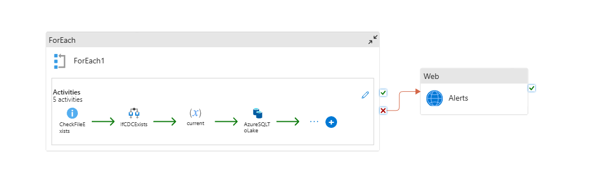
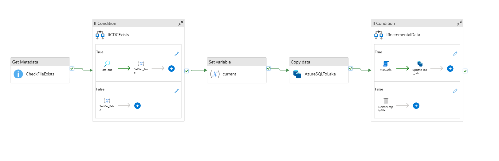
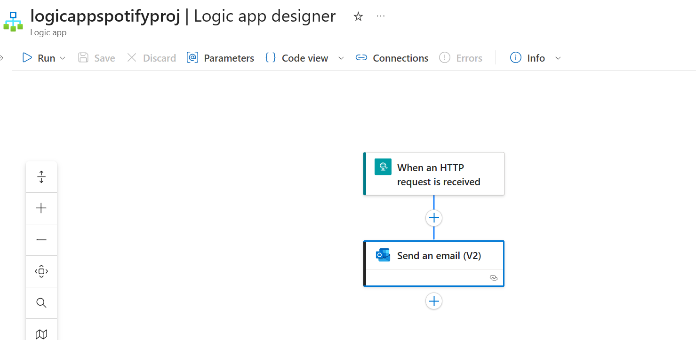
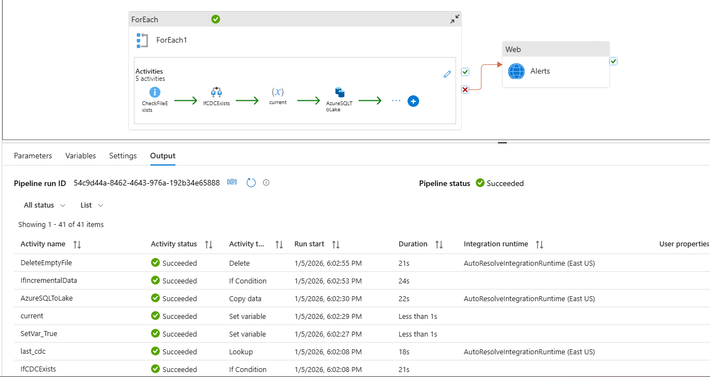

# Spotify Data Engineering Project

Azure based data pipeline for Spotify data. Current progress covers Azure Data Factory incremental ingestion into ADLS Gen2 Bronze. Databricks is next.

## What it does

1. Loops through a JSON config of tables
2. Checks CDC bookmark per table (`<table>_CDC.json`)
3. Runs incremental query with optional `from_date` override
4. Copies data from Azure SQL to ADLS Bronze as Parquet
5. Updates CDC bookmark with latest value
6. Sends email alert using Logic App
7. Dev to Main workflow with ADF publish

## Screenshots

ADF pipeline overview  

Incremental loop details  

CDC bookmark file  

Logic App notification  

Successful run output  

## Status

ADF completed  
Next: Databricks transformations
